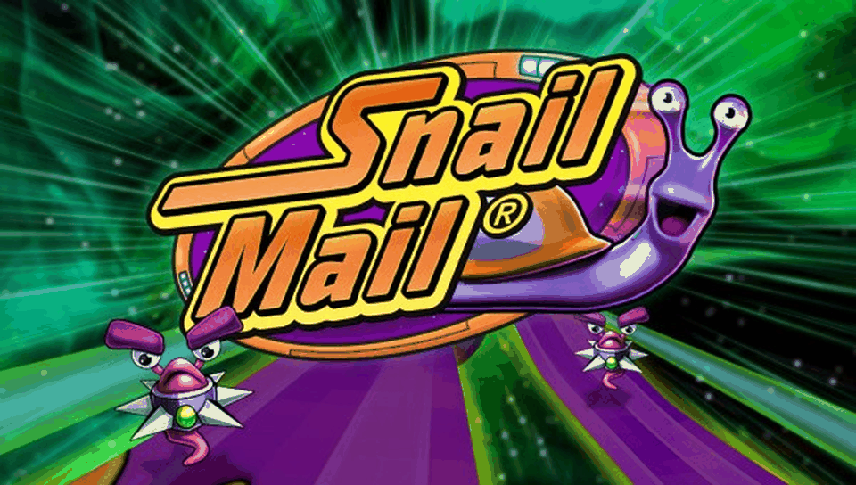

<h1 align="center">
Snail Mail · PSVita Port
</h1>
<p align="center">
  <a href="#installation-instructions">How to install</a> •
  <a href="#known-issues--current-limitations">Known Issues</a> •
  <a href="#controls">Controls</a> •
  <a href="#build-instructions-for-developers">How to compile</a> •
  <a href="#credits--acknowledgments">Credits</a>
</p>

<p align="center">
  
</p>

**Snail Mail** is the fast-paced interstellar racing game originally developed by Sandlot Games, where you guide Turbo the snail across dynamic tracks full of obstacles, slugs, and speed boosters across the galaxy.

This repository contains a **wrapper/loader** for the Android release of Snail Mail, running native ARM dynamic libraries (`.so`) on the PlayStation Vita via [TheFloW](https://github.com/TheOfficialFloW)'s Android SO Loader architecture, [FalsoJNI](https://github.com/v-atamanenko/falso_jni), and [vitaGL](https://github.com/Rinnegatamante/vitaGL).

---

## ⚠️ Legal & DMCA Disclaimer

- **Snail Mail** is the intellectual property of Sandlot Games / Digital Chocolate.
- This repository does **NOT** contain any original game code, proprietary executables, assets, or copyrighted files.
- It strictly provides open-source loader and adaptation code for homebrew execution.
- To play the game on PS Vita, you **MUST** legally own the Android version of Snail Mail (`com.sandlotgames.snailmail`) and provide your own game files (`libsnailmail.so`, `assets/asm.mp3`, and `.ogg` audio files).

---

## ✨ Features & Control Support

- **Universal Controls (Tilt & Touch Modes)**:
  - Physical controls (Left Analog Stick and D-Pad) steer Turbo regardless of whether **"Tilt Mode"** or **"Touch Mode"** is selected in settings.
  - In Tilt Mode the game receives a stable, centered accelerometer vector, so the camera no longer drifts.
  - Front Touchscreen steering is fully functional during gameplay.
- **Physical Shooting & Pause**:
  - **Cross (X)** / **R1** fire from Turbo's current lane (left, center or right) without pulling him to the center; hold for auto-fire while you keep steering.
  - **START** opens the in-game pause menu.
- **Physical Menu Navigation**:
  - **D-Pad** and **Left Analog Stick** move a virtual cursor; the button under it is highlighted.
  - **Cross (X)** / **R1** tap the button under the cursor (menus, Continue screens, tutorial cards).
  - Front Touchscreen remains fully supported at the same time.
- **In-Game Controls Menu (START + SELECT)**:
  - Remap SHOOT, STEER LEFT/RIGHT and PAUSE, adjust DEADZONE and SENSITIVITY, or reset to defaults. Saved automatically to `ux0:data/snailmail/controls.txt`.

---

## Known Issues / Current Limitations

> [!WARNING]
> - **GPU hang during the tutorial (under observation)**: earlier builds could freeze the console's GPU at a fixed point of the tutorial (when Turbo becomes invincible). v01.01 adds several protections (see [release notes](Docs/RELEASE_v01.01.md)) and the tutorial has been completed without freezing on real hardware, but the exact trigger is not yet confirmed. If it happens, please share `ux0:data/snailmail/logs/snailmail_NNN.log` and the crash dump from `ux0:data/`.
> - **Missing textures in the original data**: the game itself logs a few `Cannot find Texture X/...` messages while loading (also present in the Android build); they are harmless.
> - **OpenFeint** (online leaderboards/achievements) is a discontinued service and is not available.

---

## Installation Instructions

### Requirements

1. PlayStation Vita running custom firmware (**HENkaku**, **Enso**, or h-encore² on 3.60 / 3.65).
2. The following kernel and user plugins installed in `ur0:tai/config.txt`:
   ```ini
   *KERNEL
   ur0:tai/kubridge.skprx
   ur0:tai/fd_fix.skprx
   ```
3. Runtime shader compiler `libshacccg.suprx` installed on your PS Vita (extractable using `ShaRKBR33D`).
4. `snailmail.vpk` (installed via VitaShell).

### Data Files Setup

1. Install `snailmail.vpk` on your PS Vita.
2. Obtain a legally purchased copy of **Snail Mail** for Android (`.apk`).
3. Rename the `.apk` extension to `.zip` and extract its contents:
   - Copy `lib/armeabi-v7a/libsnailmail.so` (or `lib/armeabi/libsnailmail.so`) to `ux0:data/snailmail/libsnailmail.so`.
   - Copy `assets/asm.mp3` to `ux0:data/snailmail/assets/asm.mp3`.
   - Copy all 118 `.ogg` audio files from `assets/` to `ux0:data/snailmail/assets/`.
4. Ensure the following folder layout is present on your console:

```
ux0:data/snailmail/
├── libsnailmail.so
├── assets/
│   ├── asm.mp3
│   ├── mainmenu.ogg
│   ├── music1.ogg
│   ├── ... (all remaining .ogg audio files)
├── logs/                   <- created automatically (snailmail_NNN.log)
└── saves/                  <- created automatically (savegame and settings)
```

---

## Controls

| Input | In-Game Action | Menu Navigation |
|:---:|:---|:---|
| **Left Analog Stick** | Steer Turbo (analog) | Move virtual cursor |
| **D-Pad** | Steer Turbo (Left / Right) | Move virtual cursor |
| **Cross (X)** | Shoot from current lane (hold for auto-fire) | Tap button under cursor |
| **R1** | Shoot (alternative) | Tap button under cursor |
| **START** | Open pause menu | — |
| **START + SELECT** | Open controls menu | Open / close controls menu |
| **Front Touchscreen** | Touch steering / fire | Direct touch selection |

> [!TIP]
> **In-game controls menu**: press **START + SELECT** together to open the
> Carnivores-style remapping menu (SHOOT, STEER LEFT/RIGHT, PAUSE, DEADZONE,
> SENSITIVITY, RESET). Changes are saved automatically to
> `ux0:data/snailmail/controls.txt`, which can also be edited by hand.
> Available actions to bind: `CROSS`, `CIRCLE`, `TRIANGLE`, `SQUARE`, `LTRIGGER`, `RTRIGGER`, `START`, `SELECT`, `UP`, `DOWN`, `LEFT`, `RIGHT`.
>
> **Tilt Mode**: the game is fed a stable centered accelerometer vector
> `(0, 0, 1)` every frame, so the screen stays centered instead of drifting
> when Tilt controls are selected. The stick / D-Pad keep steering Turbo
> through the mouse path in both modes.

---

## Build Instructions (For Developers)

### Prerequisites

- [VitaSDK](https://vitasdk.org/) with `softfp` toolchain (`arm-vita-eabi`).
- CMake 3.20 or newer.
- Ninja or Make.

### Compiling

```bash
# Clone the repository
git clone https://github.com/metalsyntax/Snail-Mail-vita.git
cd Snail-Mail-vita

# Configure build
cmake -S . -B build -DCMAKE_BUILD_TYPE=Release

# Compile VPK
cmake --build build
```

> [!NOTE]
> The vendored `vendor/vitaGL` carries small port-specific patches (texture
> validation in the fixed-function draw paths: `ffp_textures_valid()` in
> `ffp.c` / `draw.c`). Re-apply them if you update vitaGL.

This will automatically compile the vendored `vitaGL` library with softfp flags and generate `build/snailmail.vpk`.

---

## Credits & Acknowledgments

- **Sandlot Games / Digital Chocolate** for the original game.
- **TheFloW** for the original `.so` loader architecture and `kubridge`.
- **Rinnegatamante** for `vitaGL` and ongoing Vita homebrew contributions.
- **v-atamanenko** for `FalsoJNI` and `soloader-boilerplate`.
- **VitaSDK team** for the open-source toolchain.
